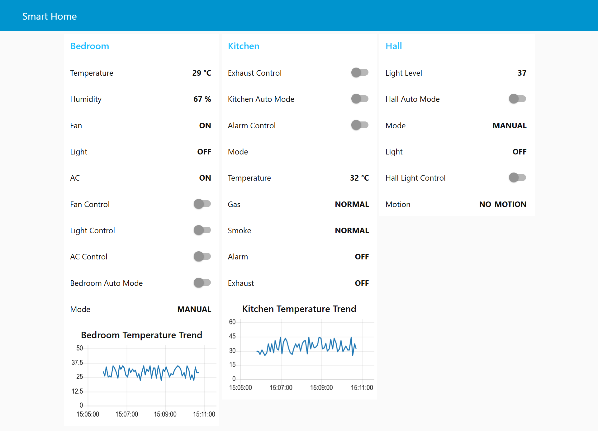

# Smart Home Automation & Safety System

## Overview

This project is an industry-style Smart Home Automation & Safety System built using Node-RED and MQTT.

The system consists of Bedroom, Kitchen, and Hall modules with automatic and manual control capabilities.

---

## Technologies Used

- Node-RED
- MQTT
- Mosquitto Broker
- JavaScript
- Dashboard UI
- Virtual ESP32 Devices

---

## Features

### Bedroom Module

- Temperature Monitoring
- Humidity Monitoring
- Fan Automation
- Light Automation
- AC Automation
- Auto/Manual Mode

### Kitchen Module

- Temperature Monitoring
- Gas Leak Detection
- Smoke Detection
- Alarm Control
- Exhaust Control
- Auto/Manual Mode

### Hall Module

- Motion Detection
- Light Level Monitoring
- Light Automation
- Manual Light Control
- Auto/Manual Mode

---

## MQTT Architecture

Telemetry Topics

home/{room}/telemetry

Command Topics

home/{room}/{device}/set

State Topics

home/{room}/{device}/state

Mode Topics

home/{room}/mode/state

---

## Dashboard Features

- Device Status Monitoring
- Manual Controls
- Auto/Manual Mode
- Temperature Charts

---

## Future Improvements

- Device Offline Detection
- Alerts
- Data Logging
- Device Health Monitoring

- ## Dashboard

---

## Author

Adeeb Khan
